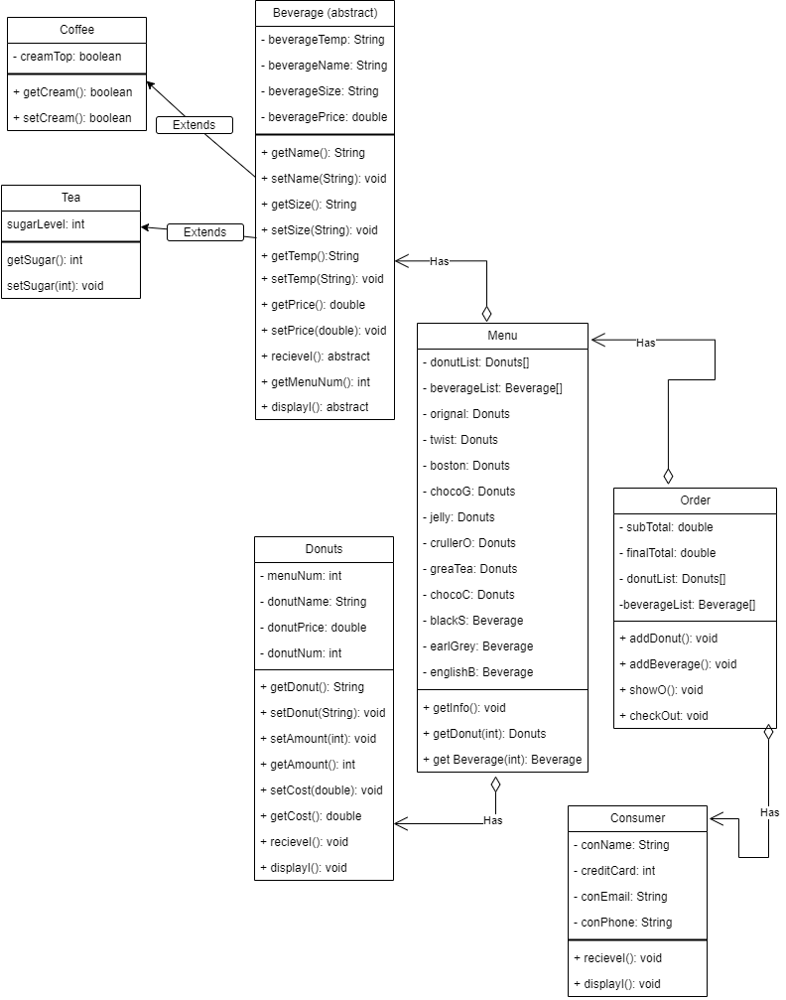

# ICS4U OOP Assignment

[*see instructions for details*](Instructions.md)

 .

## Summary
This program is a prototype of an online self ordering website of a donut shop. In this system, the Menu class contains all of Golden Donut's food products and beverages. When the user selects food items, it is stored in the order class. As result the order class calculates the total payment with and without taxes. In order to fully register that the user has purchased the food items, the system asks for the user's personal info.  

